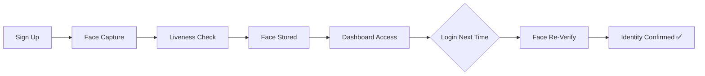
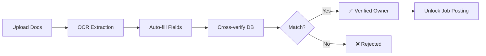
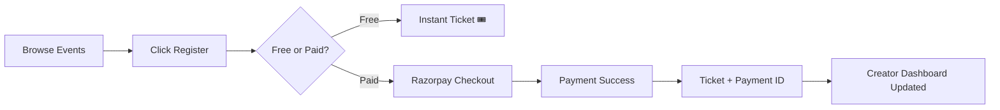

<div align="center">

<!-- Animated Header -->


<br/>

<!-- Animated Typing Effect -->
<a href="https://git.io/typing-svg"></a>

<br/><br/>

<!-- Badges -->
[](https://www.typescriptlang.org/)
[](https://react.dev/)
[](https://fastify.dev/)
[](https://razorpay.com/)
[](https://python.org/)
[](https://vitejs.dev/)

<br/>

<!-- Social Badges -->
[](https://github.com/kanglesoham11-code/HIREX)
[](https://github.com/kanglesoham11-code/HIREX)
[](https://github.com/kanglesoham11-code/HIREX/issues)
[](LICENSE)

</div>

---

<div align="center">
  <h3>🏢 Face Verification System Design</h3>
  <p><em>A full-stack enterprise architecture mirroring a LinkedIn-style professional network, heavily focused on integrating a robust AI-powered face verification system. Includes document-based ownership verification, deep facial recognition, real-time networking, and Razorpay-integrated event management.</em></p>
</div>

---

## ✨ Feature Highlights

<table>
<tr>
<td width="50%">

### 🔐 AI Face Verification
- Real-time webcam face capture & liveness detection
- DeepFace-powered facial recognition engine
- Secure identity binding on login & registration
- Anti-spoofing protection layer

</td>
<td width="50%">

### 🏢 Company Ownership Verification
- Upload official documents (GST, CIN, PAN, UDYAM)
- OCR-powered text extraction from certificates
- Cross-verification against government database entries
- Automated approval/rejection pipeline

</td>
</tr>
<tr>
<td width="50%">

### 💼 LinkedIn-Style Job Board
- Verified owners post jobs gated by document approval
- Any user can browse, search, and apply with cover letters
- Applicant dashboard with shortlist/reject workflows
- Real-time notification feed on owner's dashboard

</td>
<td width="50%">

### 🎪 Events with Razorpay Payments
- Create free or paid events with ticket pricing
- Early bird discounts with countdown deadlines
- Razorpay PCI-DSS compliant checkout integration
- Refund policy engine (Full / Partial / None)

</td>
</tr>
<tr>
<td width="50%">

### 🤝 Professional Network
- Discover all registered users platform-wide
- Send / Accept / Reject connection requests
- LinkedIn-style Connected / Received / Sent tabs
- Per-user authentication tokens for accurate routing

</td>
<td width="50%">

### 📰 Social Feed
- Post text, images, and videos to the feed
- Base64 media handling with 100MB upload support
- Like, comment, and engage with professional content
- Media-rich post rendering with inline video players

</td>
</tr>
</table>

---

## 🏗️ Architecture

```
┌──────────────────────────────────────────────────────────────────┐
│                         HIREX PLATFORM                           │
├──────────────────────────────────────────────────────────────────┤
│                                                                  │
│  ┌─────────────┐  ┌──────────────┐  ┌────────────────────────┐  │
│  │  React 18    │  │  Fastify 4   │  │  Python FastAPI        │  │
│  │  + Vite      │  │  REST API    │  │  Face AI Server        │  │
│  │  + Zustand   │  │  + WebSocket │  │  + DeepFace            │  │
│  │  Port: 3000  │  │  Port: 3001  │  │  Port: 8000            │  │
│  └──────┬───────┘  └──────┬───────┘  └──────────┬─────────────┘  │
│         │                 │                      │                │
│         └────────┬────────┘                      │                │
│                  │                               │                │
│         ┌────────▼────────┐             ┌────────▼────────┐      │
│         │   localStorage  │             │  Document OCR   │      │
│         │   (Demo Mode)   │             │  Verification   │      │
│         └────────┬────────┘             └────────┬────────┘      │
│                  │                               │                │
│         ┌────────▼────────────────────────────────▼────────┐      │
│         │              Razorpay Payment Gateway             │      │
│         │         PCI-DSS Compliant • INR Payments          │      │
│         └──────────────────────────────────────────────────┘      │
│                                                                   │
└───────────────────────────────────────────────────────────────────┘
```

---

## 🛠️ Tech Stack

<div align="center">

| Layer | Technology | Purpose |
|:---:|:---:|:---:|
| **Frontend** |    | SPA with HMR, type-safe components |
| **State** |   | Global auth state + persistent data |
| **Backend** |   | High-performance REST API |
| **AI / ML** |   | Face verification, document OCR |
| **Payments** |  | PCI-DSS compliant payment gateway |
| **Styling** |   | Custom design system, 200+ icons |

</div>

---

## 🚀 Quick Start

### Prerequisites

- **Node.js** >= 18.0.0
- **Python** >= 3.10
- **npm** or **yarn**

### 1. Clone & Install

```bash
git clone https://github.com/kanglesoham11-code/HIREX.git
cd HIREX

# Install backend + root dependencies
npm install

# Install frontend dependencies
cd frontend && npm install && cd ..

# Install Python dependencies (for Face AI)
pip install fastapi uvicorn deepface opencv-python pydantic python-multipart
```

### 2. Configure Environment

```bash
# Copy the template and fill in your keys
cp .env.example .env
cp frontend/.env.example frontend/.env
```

Edit `.env` with your credentials:
```env
MONGODB_URI=your-mongodb-uri
RAZORPAY_KEY_ID=your-razorpay-key
RAZORPAY_KEY_SECRET=your-razorpay-secret
```

Edit `frontend/.env`:
```env
VITE_RAZORPAY_KEY_ID=your-razorpay-key
```

### 3. Launch All Servers

```bash
# Terminal 1: Start Node.js backend + React frontend
npm run dev

# Terminal 2: Start Python Face AI server
cd files && python -m uvicorn main:app --reload --port 8000
```

### 4. Open in Browser

```
🌐 Frontend:  http://localhost:3000
⚡ Backend:   http://localhost:3001
🤖 Face AI:   http://localhost:8000
```

---

## 📂 Project Structure

```
HIREX/
├── 📁 backend/
│   └── 📁 src/
│       ├── 📁 middleware/      # Auth, rate limiting, CORS
│       ├── 📁 routes/          # API route handlers
│       ├── 📁 services/        # Business logic layer
│       ├── 📁 config/          # Database & app configuration
│       └── 📄 server.ts        # Fastify server entry point
│
├── 📁 frontend/
│   └── 📁 src/
│       ├── 📁 components/      # Layout, Navbar, FaceVerification
│       ├── 📁 pages/           # All application pages
│       │   ├── 📄 DashboardPage.tsx     # Notifications + overview
│       │   ├── 📄 FeedPage.tsx          # Social feed with media
│       │   ├── 📄 ConnectionsPage.tsx   # Professional network
│       │   ├── 📄 JobsPage.tsx          # Job board + applications
│       │   ├── 📄 EventsPage.tsx        # Events + Razorpay
│       │   ├── 📄 CompanyClaimPage.tsx   # Document verification
│       │   └── 📁 auth/                 # Face verification flow
│       ├── 📁 store/           # Zustand auth store
│       └── 📁 lib/             # API client, utilities
│
├── 📁 files/
│   ├── 📄 main.py              # FastAPI face verification server
│   ├── 📄 companies_db.json    # Company registry database
│   └── 📄 faces.json           # Registered face data
│
├── 📄 .env.example             # Environment template (safe)
├── 📄 package.json             # Root monorepo config
└── 📄 README.md                # You are here! 📍
```

---

## 🔄 Core User Flows

### 🔐 Registration & Verification


### 🏢 Company Ownership Claim


### 💳 Event Payment Flow


---

## 🎯 Key Pages

| Page | Route | Description |
|:---|:---|:---|
| **Dashboard** | `/dashboard` | Welcome hub with notifications for job apps & event payments |
| **Feed** | `/feed` | Social feed with text, image, video posting |
| **Network** | `/connections` | Discover, connect, manage professional relationships |
| **Jobs** | `/jobs` | Browse listings, apply, or post jobs (verified owners) |
| **Events** | `/events` | Create/attend events with free or Razorpay-paid tickets |
| **Company Claim** | `/company-claim` | Upload & verify business documents for ownership |
| **Profile** | `/profile` | View and manage your professional profile |
| **Settings** | `/settings` | Account and platform preferences |

---

## 🔒 Security Features

- 🧠 **AI Face Verification** — DeepFace anti-spoofing for every login
- 📄 **Document OCR Validation** — Cross-reference uploaded certificates with database
- 🔑 **Per-user JWT Tokens** — Unique encoded tokens prevent identity confusion
- 💳 **PCI-DSS Payments** — Razorpay handles all card data; nothing stored locally
- 🛡️ **Rate Limiting** — Fastify-powered request throttling
- 🚫 **No Keys in Code** — All secrets in `.env` files (gitignored)

---

## 🤝 Contributing

Contributions are welcome! Please follow these steps:

1. **Fork** the repository
2. **Create** your feature branch (`git checkout -b feature/amazing-feature`)
3. **Commit** your changes (`git commit -m 'feat: add amazing feature'`)
4. **Push** to the branch (`git push origin feature/amazing-feature`)
5. **Open** a Pull Request

---

## 📄 License

This project is licensed under the **MIT License** — see the [LICENSE](LICENSE) file for details.

---

<div align="center">


<br/>

**Built with ❤️ by [Soham Kangle](https://github.com/kanglesoham11-code)**

<br/>

<a href="https://github.com/kanglesoham11-code/HIREX"></a>

</div>
